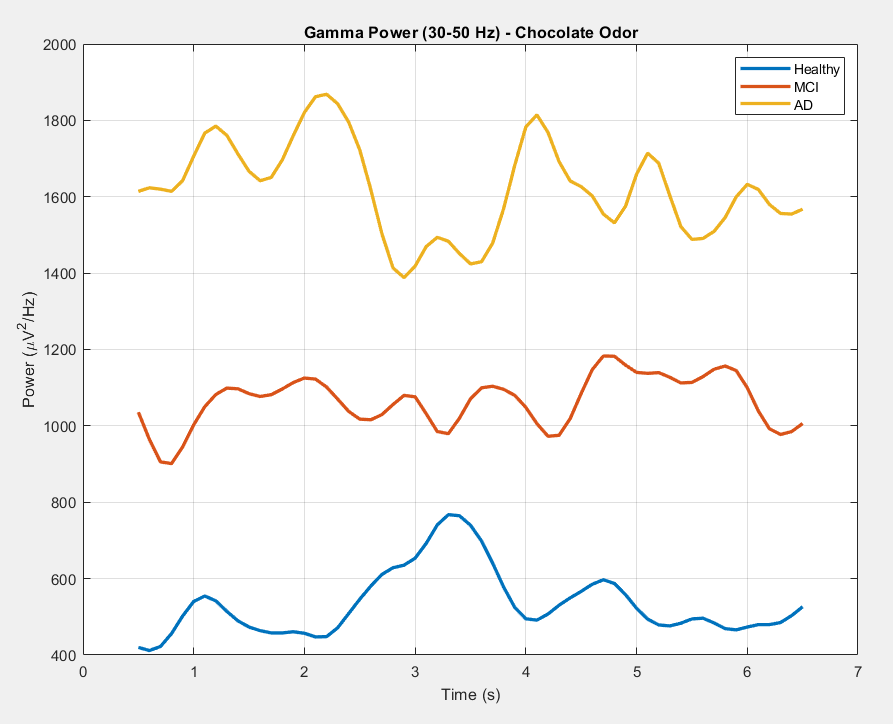
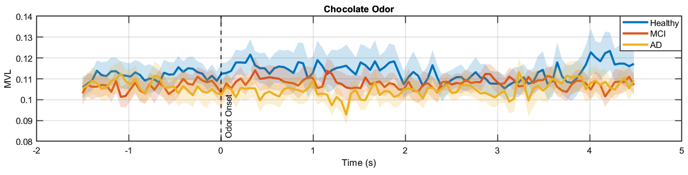

## Signals and Systems Project

This project dives into **EEG brain signals** to see if we can find an early warning sign—a **biomarker**—for Alzheimer's Disease, specifically by looking at how the brain reacts when people smell things (**olfactory stimulation**).

---

### Phase 1: EEG Power Analysis

We started by cleaning up and processing a lot of raw EEG data from three groups: **Healthy individuals**, people with **Mild Cognitive Impairment (MCI)**, and **Alzheimer's patients**. This involved meticulous steps like filtering, removing noisy channels, and using advanced techniques (ASR, ICA) to ensure we were only looking at the clean brain signals.

We then segmented the signals into short time windows centered around when the odor was presented and focused on two key brain rhythms:

* **Theta (4–8 Hz)**
* **Gamma (30–50 Hz)**

#### Key Finding

The initial analysis showed that the brains of **Alzheimer's patients exhibited elevated gamma power and altered theta activity**. This strong evidence provided a solid foundation for the next phase, which investigated the relationship between these two waves.

  

---

### Phase 2: Phase-Amplitude Coupling - PAC

This is the core of the project. We examined **PAC**—essentially, seeing if the *timing* (phase) of the slower **theta** wave influences the *strength* (amplitude) of the faster **gamma** wave. We used metrics like **MVL** and **MI** to measure this communication.

We quantified the PAC's **strength**, **timing**, and **spatial organization** across all groups and odors.

#### Key Finding

Our most significant discovery is that **this brain communication (PAC) gets weaker as cognitive impairment progresses.** The Alzheimer's subjects showed severely **disrupted temporal and spatial patterns** in their PAC. This highlights PAC as a potentially powerful and sensitive **biomarker for cognitive decline.**

  

